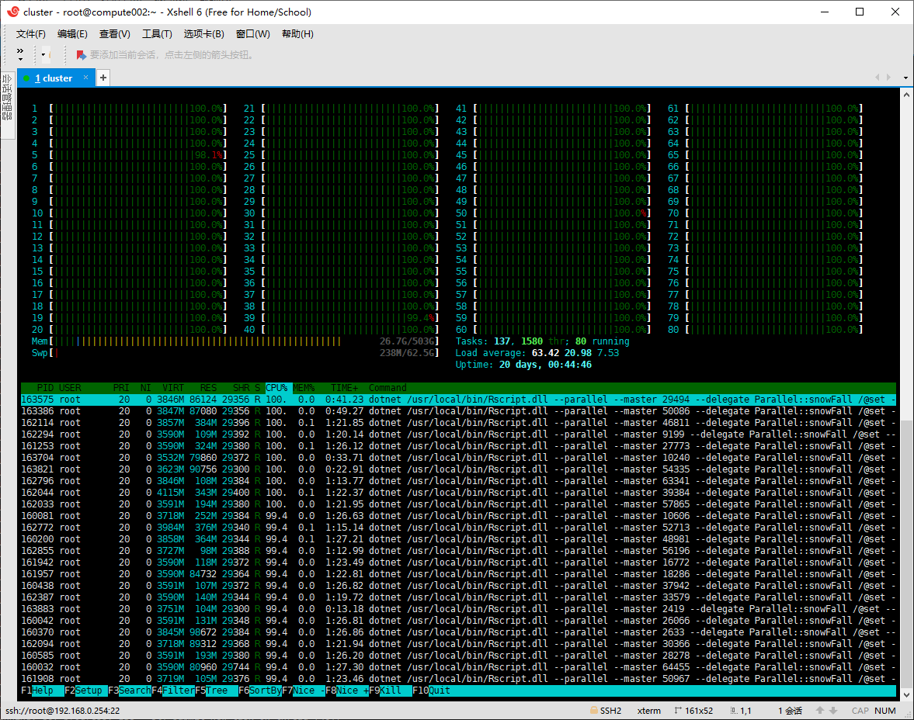
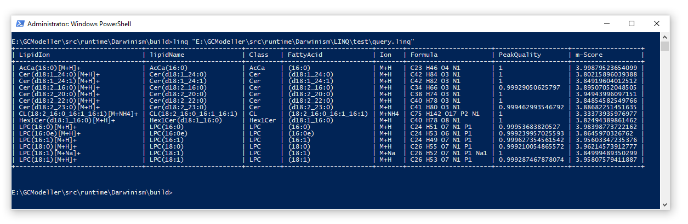

# Darwinism

Darwinism High performance computing toolkit for VisualBasic.NET on unix .net 5

# [snowFall](https://github.com/SMRUCC/R-sharp/tree/21da4976865217233def41fcbf11bbccb1f84096/snowFall) R# package

By combining of the Darwinism Parallel library and the R# [snowFall](https://github.com/SMRUCC/R-sharp/tree/21da4976865217233def41fcbf11bbccb1f84096/snowFall) package, that you can solve a large scale scientific problem in full power on the UNIX .NET 5 platform



## [LINQ Script](LINQ/LINQ)

```vbnet
FROM x AS row 
IN "E:\GCModeller\src\runtime\Darwinism\LINQ\test\data.csv"
WHERE x.PeakQuality >= 0.999
SELECT x.LipidIon,  
       lipidName = x.Class & x.FattyAcid,   
	   x.Class,	
	   x.FattyAcid,	
	   x.Ion,	
	   x.Formula,
	   x.PeakQuality,
	   x."m-Score"
	   
SKIP 100
ORDER BY pow("m-Score", PeakQuality) DESCENDING
TAKE 15
```


