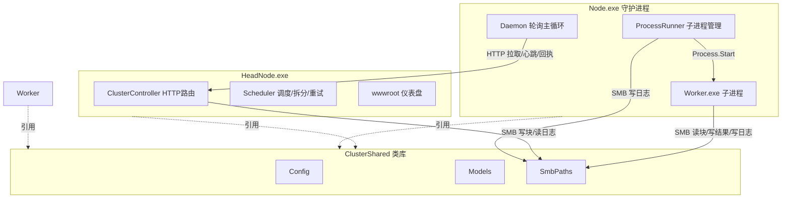

## 用户需求

将当前单体 Host 项目（通过 --mode=headnode|node|worker 扮演三种角色）分割为三个独立的 VB.NET 命令行程序项目，分别对应分布式计算集群中的三个角色。

## 产品概述

基于现有集群运行逻辑，重构为三个独立可执行程序：管理头结点（HeadNode）、计算节点守护进程（Node）、计算子进程（Worker）。三者通过 HTTP 接口与 SMB 共享文件系统协作，保持原有全部业务流程不变。

## 核心特性

- HeadNode：提供 HTTP 服务（Flute 路由 + 仪表盘静态页），负责任务提交、数据块拆分写入 SMB、任务队列调度、节点心跳收集、完成/失败回执处理、失败重试与失败日志提取、集群状态快照。
- Node：守护进程每秒轮询 HeadNode 拉取任务，启动独立 Worker 子进程执行计算，持续读取子进程 stdout/stderr 归档到 SMB 日志并按秒发送心跳，依据子进程 ExitCode 向 HeadNode 回执完成或失败。
- Worker：独立子进程，通过反射动态加载 CLR assembly 调用指定方法，从 SMB 读取数据块、写回结果文件，异常时记录描述与栈追踪到日志并设置 ExitCode=1（失败）或 0（成功）。
- 共享代码抽离为独立类库 ClusterShared，三个项目共同引用，避免代码重复。
- 原 Host 项目删除，解决方案改为引用 ClusterShared 与三个新项目。

## 技术栈选择

- 语言与框架：VB.NET + .NET 10（net10.0），与现有项目保持一致。
- 类库：ClusterShared.vbproj（类库，命名空间 ClusterShared）。
- Web 框架：Flute.Http（Flute.NET5.vbproj，仅 HeadNode 引用），用于 HTTP 路由与静态托管。
- 基础库：Microsoft.VisualBasic.Core（Core.vbproj），提供 App、Serialization.JSON 等工具，三个项目均引用。
- 构建系统：Microsoft.NET.Sdk，沿用现有 .vbproj 格式与项目引用方式。

## 实现方案

整体策略：将现有 Host 项目按角色边界物理拆分成四个项目（1 个类库 + 3 个 exe），源文件按职责平移到目标项目，仅修改入口与配置解析相关代码，业务逻辑（Scheduler/ClusterController/Daemon/ProcessRunner/ReflectHost/Models/SmbPaths）保持不变。

关键决策与理由：

1. **ClusterShared 类库**：将 Shared/ 下 Config.vb、Models.vb、SmbPaths.vb 移入类库，RootNamespace 设为 ClusterShared。这三个文件当前无 Flute 依赖，类库可独立编译，三个 exe 引用后消除代码重复，符合 DRY。源文件已位于 `Namespace ClusterShared` 内，无需改命名空间。
2. **Worker 可执行路径解析**：原 `Config.WorkerExecutable` 返回当前进程路径（因 worker 与 node 同 exe）。拆分后改为：默认尝试 `Path.Combine(进程所在目录, "worker.exe")`；若文件不存在，则回退读取 `--worker=path` 命令行参数或 `WORKER_EXE` 环境变量。需在 Config 增加 `workerExe` 字段并在 Parse 中解析 `--worker`。Node 的 ProcessRunner 使用此属性启动子进程。
3. **各项目入口收敛**：HeadNode/Program.vb 仅处理 headnode（删除 node/worker 分支）；Node/Program.vb 仅处理 node；Worker/Program.vb 直接调用 `ReflectHost.Run(args)` 并将返回值透传为 ExitCode。原 Host/Program.vb 的分发逻辑被拆解删除。
4. **wwwroot 归属 HeadNode**：仪表盘静态资源（index.html、app.js、style.css、kb.css）随 HeadNode 项目，保留 `CopyToOutputDirectory=PreserveNewest`。
5. **删除 Host**：移除整个 Host 目录及 slnx 中对 Host.vbproj 的引用，避免重复维护。

性能与可靠性：拆分不改变运行时行为，无新增性能开销；共享类库减少编译产物体积与重复类型。心跳与日志归档沿用原异步读取 + 锁机制，避免子进程阻塞。

## 实现注意事项

- **向后兼容**：三个 exe 的命令行参数格式保持与原 Host 一致（headnode 用 --port/--smb/--name/--token 等；node 用 --head/--node/--poll/--smb 等；worker 位置参数不变），仅新增 node 端的 --worker 可选参数。
- **Worker 路径回退顺序**：进程目录默认文件 → --worker 参数 → WORKER_EXE 环境变量，缺失时给出明确错误提示而非静默失败。
- **SMB 路径约定**：SmbPaths 与 Models 完全复用，不修改布局，确保 HeadNode 写入与 Worker 读取、Node 归档三者路径一致。
- **解决方案文件**：DistributedCluster.slnx 改为引用 Flute、Core、ClusterShared 及三个新 exe 项目，保持相对路径正确。

## 架构设计



## 目录结构

```
DistributedCluster/
├── ClusterShared/                  # [NEW] 共享类库项目
│   ├── ClusterShared.vbproj         # [NEW] 类库工程，RootNamespace=ClusterShared，引用 Core，net10.0
│   ├── Config.vb                    # [NEW] 从 Host/Shared/Config.vb 平移，增加 workerExe 字段与 --worker 解析，WorkerExecutable 改为路径回退逻辑
│   ├── Models.vb                    # [NEW] 从 Host/Shared/Models.vb 原样平移（TaskBlock/NodeHeartbeat/TaskResult/ClusterStatus/NodeStatus/FailureInfo/JobSubmit/ApiResult）
│   └── SmbPaths.vb                 # [NEW] 从 Host/Shared/SmbPaths.vb 原样平移
├── HeadNode/                       # [NEW] 管理头结点 exe 项目
│   ├── HeadNode.vbproj             # [NEW] Exe，引用 Flute.NET5、Core、ClusterShared，CopyToOutputDirectory wwwroot
│   ├── Program.vb                  # [NEW] 仅 headnode 模式，注册 ClusterController+HttpSocket，启动 HTTP 服务
│   ├── ClusterController.vb        # [NEW] 从 Host/HeadNode/ClusterController.vb 平移（Flute 路由与静态托管）
│   ├── Scheduler.vb                # [NEW] 从 Host/HeadNode/Scheduler.vb 平移（调度/拆分/重试/快照）
│   └── wwwroot/                    # [NEW] 从 Host/wwwroot 平移：index.html、app.js、style.css、kb.css
├── Node/                           # [NEW] 计算节点守护进程 exe 项目
│   ├── Node.vbproj                 # [NEW] Exe，引用 Core、ClusterShared，net10.0
│   ├── Program.vb                  # [NEW] 仅 node 模式，解析 --worker 可选参数，启动 Daemon
│   ├── Daemon.vb                   # [NEW] 从 Host/Node/Daemon.vb 平移（轮询主循环）
│   └── ProcessRunner.vb            # [NEW] 从 Host/Node/ProcessRunner.vb 平移（子进程管理，使用 cfg.WorkerExecutable）
├── Worker/                         # [NEW] 计算子进程 exe 项目
│   ├── Worker.vbproj               # [NEW] Exe，引用 Core、ClusterShared，net10.0
│   ├── Program.vb                  # [NEW] 调用 ReflectHost.Run(args)，ExitCode 透传
│   └── ReflectHost.vb              # [NEW] 从 Host/Worker/ReflectHost.vb 平移（反射加载与计算）
├── DistributedCluster.slnx         # [MODIFY] 删除 Host 引用，新增 ClusterShared + HeadNode/Node/Worker 引用
└── Host/                           # [DELETE] 整个目录随重构删除
```

## 关键代码结构

在原 Config.vb 基础上，WorkerExecutable 属性改为如下回退逻辑（伪代码，实际为 VB）：

```
Public ReadOnly Property WorkerExecutable As String
    Get
        If Not String.IsNullOrEmpty(workerExe) AndAlso File.Exists(workerExe) Then
            Return workerExe
        End If
        Dim env = Environment.GetEnvironmentVariable("WORKER_EXE")
        If Not String.IsNullOrEmpty(env) AndAlso File.Exists(env) Then
            Return env
        End If
        Dim guess = Path.Combine(Path.GetDirectoryName(Process.GetCurrentProcess().MainModule.FileName), "worker.exe")
        If File.Exists(guess) Then Return guess
        Return guess ' 回退默认值，由调用方检测存在性
    End Get
End Property
```

## Agent Extensions

### SubAgent

- **code-explorer**
- Purpose: 在删除 Host 与创建新项目时，跨目录校验 Flute/Core 项目引用路径、确认无其他代码引用 Host 命名空间或类型，避免遗漏依赖。
- Expected outcome: 输出受影响的引用清单与确认结果，保障重构后解决方案可正常编译。