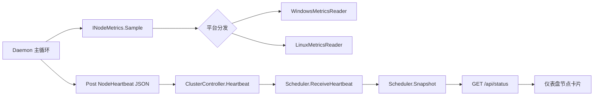

## 用户需求

在现有的 VB.NET 分布式计算集群环境中，扩充仪表盘采集与展示的计算节点信息，使管理头节点能向仪表盘返回更丰富的节点运行时数据。

## 产品概述

当前计算节点仅向头结点上报少量信息（节点 id、当前块、逻辑核心数、日志）。需要让计算节点守护进程采集更完整的资源与网络指标，经统一心跳接口上报，并在仪表盘网页以节点卡片形式可视化展示。

## 核心功能

- 计算节点端采集以下信息：CPU 核心数量、当前 CPU 使用率、物理内存总量、当前内存使用率、网络上传速率、网络下载速率、IP 地址、计算机名称。
- 计算节点采集逻辑通过抽象接口 + 平台分发实现，分别适配 Windows 与 Linux 两套底层 API；运行时根据操作系统选择实现，统一调用。
- 实时指标（CPU 使用率、内存使用率、网络速率）在计算节点端通过两次采样求差计算后上报，头结点仅存储透传。
- 扩展统一心跳接口 `/api/heartbeat`，将新增指标随心跳上报至头结点，由 Scheduler 汇总进状态快照。
- 仪表盘网页将原有“节点心跳”列表升级为节点卡片，展示 IP、计算机名、核心数、CPU/内存使用率进度条、网络上下行速率等丰富信息，并保持主题与布局一致。

## 技术栈

- 语言：VB.NET（.NET，跨平台）
- 现有框架：Flute.Http（头结点 REST 服务）、Microsoft.VisualBasic 序列化（JSON）
- 共享模型：ClusterShared 项目（Models.vb、Config.vb）
- 前端：原生 HTML + CSS + JavaScript（仪表盘静态页）
- 平台适配：System.Runtime.InteropServices.RuntimeInformation 运行时判断，非条件编译

## 实现方案

### 整体策略

采用“节点采集 → 统一心跳上报 → 头结点透传 → 仪表盘展示”的数据链路，保持现有架构无状态、内存态快照的设计不变。新增指标仅在数据模型、采集层、心跳参数、前端渲染四处扩展，不改动任务分发与回执逻辑。

### 关键技术决策

1. **采集抽象（INodeMetrics + 双实现）**：在 Node 项目新建 `INodeMetrics` 接口与 `NodeMetrics` 数据类；`WindowsMetricsReader` 用 PerformanceCounter / ComputerInfo / NetworkInterface，`LinuxMetricsReader` 解析 `/proc/stat`、`/proc/meminfo`、`/proc/net/dev`。Daemon 按 `RuntimeInformation.IsOSPlatform` 选择实现。理由：解耦平台差异，便于扩展与单测，符合用户确认方案。
2. **两次采样求差在节点端**：采集器持有上一次样本，`Sample()` 返回已计算好的 CPU 使用率%、内存使用率%、上下行速率（字节/秒）。理由：头结点无法跨机读 `/proc`，且避免头结点维护时序历史。
3. **心跳上报采用 JSON Body**：将 `NodeHeartbeat` 以 JSON POST 到 `/api/heartbeat`，替代零散 query 参数。理由：字段增多后 JSON 更健壮、可扩展，且 ClusterShared 已有 JSON 序列化支持。Daemon 端用 HttpClient PostAsync 发送序列化对象；ClusterController 改为读取 body 反序列化。为保持兼容，heartbeat 端点同时容忍空/缺字段（默认 Environment.ProcessorCount 等）。
4. **模型扩展**：`NodeHeartbeat` 与 `NodeStatus` 增加 `ipAddress, machineName, cpuUsage, totalMemoryMB, memoryUsage, netUploadRate, netDownloadRate` 字段；`ClusterStatus` 因含 `nodes As NodeStatus()` 自动带入，无需改结构。
5. **性能与可靠性**：采集为轻量系统调用，每秒一次，开销可忽略；采样差计算为 O(1)。Linux 文件读取失败（如容器无 `/proc`）时降级为默认值并打日志，不阻断心跳。前端渲染复用现有 1.5s 轮询，仅替换 `renderNodes` 为卡片模板，无额外请求。

## 实现注意事项

- 复用现有 `Config`、`Scheduler.heartbeats` 字典与 `Snapshot()` 映射逻辑，新增字段从 `hb` 透传到 `NodeStatus`，避免破坏现有聚合计数。
- 心跳解析需向后兼容：新增字段缺省时给合理默认（cores 用 Environment.ProcessorCount，速率/使用率给 0 或 -1 表示未知）。
- 前端 `escapeHtml` 已存在，卡片渲染需对所有动态文本转义，防止 XSS。
- 进度条样式复用现有 `--accent` 等 CSS 变量，保持 light/dark 主题一致。
- 不改动任务拉取（PullTask）、回执（done/failed）、作业提交逻辑，控制改动范围。

## 架构设计

数据链路：



## 目录结构

```
ClusterShared/
└── Models.vb              # [MODIFY] 扩展 NodeHeartbeat 与 NodeStatus，新增 ipAddress, machineName, cpuUsage, totalMemoryMB, memoryUsage, netUploadRate, netDownloadRate 字段

Node/
├── Daemon.vb             # [MODIFY] 集成 INodeMetrics 采集；每秒 Sample 后随心跳以 JSON Body 上报 NodeHeartbeat
├── INodeMetrics.vb       # [NEW] 指标采集接口定义与 NodeMetrics 数据类（含平台无关的采样结果）
├── WindowsMetricsReader.vb # [NEW] Windows 平台实现：PerformanceCounter/ComputerInfo/NetworkInterface/Dns
└── LinuxMetricsReader.vb   # [NEW] Linux 平台实现：解析 /proc/stat、/proc/meminfo、/proc/net/dev

HeadNode/
├── ClusterController.vb  # [MODIFY] Heartbeat 端点改为读取 JSON Body 反序列化为 NodeHeartbeat（兼容缺省字段）
├── Scheduler.vb         # [MODIFY] Snapshot() 中将 NodeHeartbeat 新增字段映射到 NodeStatus
└── wwwroot/
    ├── index.html       # [MODIFY] 升级“节点心跳”区块为节点卡片容器
    ├── app.js           # [MODIFY] 重写 renderNodes 为节点卡片渲染（进度条、IP、机器名、网络速率）
    └── style.css        # [MODIFY] 新增节点卡片、使用率进度条、网络速率等样式
```

## 关键代码结构

```
' INodeMetrics.vb
Public Class NodeMetrics
    Public Property cpuCores As Integer
    Public Property cpuUsage As Double          ' 0-100
    Public Property totalMemoryMB As Long
    Public Property memoryUsage As Double       ' 0-100
    Public Property netUploadRate As Double     ' bytes/sec
    Public Property netDownloadRate As Double   ' bytes/sec
    Public Property ipAddress As String
    Public Property machineName As String
End Class

Public Interface INodeMetrics
    Function Sample() As NodeMetrics
End Interface
```

## 设计风格

沿用现有仪表盘极光背景、卡片式栅格与 light/dark 双主题风格，将“节点心跳”区块升级为节点资源监控卡片列表。每张卡片延续现有的玻璃质感卡片与圆角阴影，内部以紧凑分区展示节点身份（计算机名 + IP + 状态点）与资源指标（核心数、CPU/内存使用率进度条、网络上下行速率）。交互保持轻量：hover 卡片微高亮，进度条按使用率区间变色（绿/黄/红），与现有主题变量一致，不破坏整体视觉语言。

## 页面区块设计（仅“节点心跳”区块变更）

1. 区块标题“节点资源监控”，保持 card-title 样式。
2. 节点卡片（每个节点一项）：

- 顶部行：计算机名（主标题）+ IP 地址（副文本）+ 右侧在线状态点（复用 status-online/offline）。
- 指标行一：核心数徽标（如“16 核”）+ 当前计算块/空闲状态。
- 指标行二：CPU 使用率标签 + 横向进度条（按百分比宽度，颜色随阈值变化）。
- 指标行三：内存使用率标签 + 横向进度条（总量 MB 标注于右侧）。
- 指标行四：网络上行/下行速率（如“↑ 1.2 MB/s  ↓ 320 KB/s”），带上下箭头图标。

3. 空状态保留 `.empty` 样式（“暂无节点上报”）。
4. 底部追加到现有 footer 状态栏信息不变。