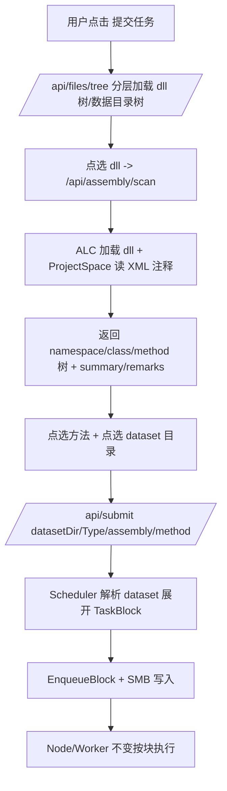

## 用户需求

优化 HeadNode 管理节点的任务提交用户体验，通过浏览器端可视化选择 CLR Assembly（dll）、目标计算函数以及 SMB 数据输入目录，替代原本纯手工填写文本框的方式。

## 产品概述

在 HeadNode 命令行新增 `web 文件系统根目录` 参数（默认 `/mnt/smb`，一般为 `/mnt/` 下的 smb 共享目录）。用户在管理页面点击【＋ 提交任务】弹窗中，通过文件树浏览选择 dll、通过反射扫描出的对象树选择方法、通过数据目录树选择 dataset 输入源，并在加载缓慢的 smb 文件系统上以惰性加载 + 等待动画保证界面不卡死。

## 核心功能

- 命令行新增 `--smb-web-root`（默认 `/mnt/smb`）参数，限定可暴露给 web 的集群文件系统根目录。
- 新增 `GET /api/files/tree?dir=相对路径`：基于 web 根分层增量返回子节点（目录 + 仅 *.dll 文件），支持惰性加载。
- 新增 `GET /api/assembly/scan?assemblyPath=...`：反射加载目标 dll，筛选符合 `Worker\ReflectHost.vb` 调用约定的公共方法（参数类型仅含 Byte()/String，String 至多 2 个），用 `ProjectSpace` 从同名 XML 注释文档取 summary/remarks，随后卸载 dll，返回方法对象树及注释。
- 提交弹窗改造：Assembly 路径通过 dll 文件树点选；方法通过 namespace→class→method 对象树点选并预览 XML 注释；数据输入通过目录树点选含 `dataset.ini` 或 `dataset.json` 的文件夹，惰性预览数据文件列表或 json 内容。
- 头节点解析 dataset：将 dataset.ini（按后缀归集多文件）或 dataset.json（大文件 + offset/size chunks）展开为多个 TaskBlock，沿用现有 chunk 拆分与 SMB 写入，Worker 不变。
- 全链路惰性加载与加载等待动画，避免 smb 繁忙时 web 界面卡死。

## 技术栈选型

- 语言/运行时：VB.NET（.NET 10，与现有 HeadNode/ClusterShared 保持一致）
- Web 服务：沿用 Flute.Http（HttpRouter 反射路由 + HttpGet/HttpPost 特性）
- 数据序列化：沿用 `Microsoft.VisualBasic.Serialization.JSON`（GetJson/LoadJSON）
- XML 注释解析：复用 `Microsoft.VisualBasic.ApplicationServices.Development.XmlDoc.Assembly.ProjectSpace`（sciBASIC# Microsoft.VisualBasic.Core），需确认 HeadNode.vbproj 已引用该程序集。
- 前端：原生 HTML + CSS + JavaScript（无框架，沿用现有 wwwroot/index.html、app.js、style.css、kb.css）

## 实现方案

### 整体策略

在 HeadNode 端新增两个独立 GET 接口（`/api/files/tree`、`/api/assembly/scan`），并对 `/api/submit` 增加 dataset 支持；Scheduler 增加 dataset 展开逻辑；前端提交弹窗改为树形交互 + 惰性加载 + loading 动画。所有修改仅限 HeadNode + wwwroot，Node/Worker 契约不变。

### 关键技术决策

1. **web 根目录独立参数**：新增 `Config.webRoot`（Opt `--smb-web-root`，默认 `/mnt/smb`）。与现有 `smbRoot`（`--smb`，jobs 数据中枢）解耦，web 仅能浏览 webRoot 子树，避免暴露 jobs 内部目录。
2. **分层文件树（后端增量）**：`/api/files/tree?dir=相对路径`。后端仅列该层直接子项：目录节点 + `*.dll` 文件节点（非 dll 文件不返回，减少载荷）。前端点开目录节点才请求下一层，天然惰性加载，避免一次性递归整棵 smb 目录。
3. **dll 反射扫描 + 注释 + 卸载**：使用 `AssemblyLoadContext`（ALC）非默认上下文加载 dll，扫描符合调用约定的方法后 `Unload()` 并触发 GC 回收，避免程序集泄漏。XML 注释文档与 dll 同名同目录（dll 名去扩展名 + `.xml`），通过 `ProjectSpace.ImportFromXmlDocFile` 加载后用 `GetProject(dllName).GetType("Ns.Class")` 取方法 summary/remarks。若注释文档缺失则留空字符串，不影响主流程。
4. **方法签名匹配**：严格对齐 `Worker\ReflectHost.vb` 的 `BuildArgs`——公共（Public，含 NonPublic 可选）方法，参数类型集合仅允许 `Byte()` / `String` / 其他（其他参数将被填 Nothing，仍可调用），但 `String` 参数至多 2 个（第一个=blockId，第二个=jobRoot）。扫描时筛选 `Public` 方法（Static/Instance，含 `byte[]` 或 `string` 参数），排除属性/事件/构造函数特例。
5. **dataset 展开为块（头节点侧）**：

- `dataset.ini`：解析 `[dataset]` 下 `ext=*.dat` 与 `description`；枚举该目录下匹配后缀的文件，每个文件 `SplitFile` 按 chunkSize 拆分（沿用现有逻辑）。
- `dataset.json`：`{datafile, description, chunks:[{offset,size}]}`；按 chunks 列表将大文件切分为对应数据块（新写 `SplitFileByChunks` 依据 offset/size 读取段写入 SMB blocks），每个 chunk 一个 TaskBlock。
- 两种方式最终都通过现有 `EnqueueBlock` 入队，确保 Worker 字节块契约不变。

6. **提交接口改造**：`/api/submit` 保留 GET，新增支持 `datasetDir`（相对/绝对 SMB 目录）+ `datasetType`（auto/ini/json）参数，替代原 `inputs` 手工逗号列表（保留 `inputs` 兼容）。控制器据 `datasetDir` 调用 `scheduler.SubmitJob` 的 dataset 分支。

### 性能与可靠性

- 文件树分层返回，单次 IO 仅扫描一层目录，避免 smb 繁忙时阻塞；前端并发受控（同一时间仅一个展开请求）。
- dll 扫描在独立 ALC 中完成并强制 `GC.Collect` + `GC.WaitForPendingFinalizers` 后 `Unload`，防止句柄/内存累积。
- dataset.json 大文件读取使用带 offset/size 的 `FileStream.Seek` + 定长读缓冲，不整文件载入内存。
- 所有新增接口包 try/catch，返回 `ApiResult.Failure(msg)`，不泄露内部异常堆栈到 web。

### 避免技术债

复用现有 `ClusterController` 路由模式、Scheduler 的 `EnqueueBlock/SplitFile/smb` 写入、ClusterShared 的 `ApiResult/JobSubmit` 模型，不引入新框架或新序列化库；新模型追加在 `Models.vb` 与 ClusterShared 内，保持单一程序集依赖。

## 实现注意事项

- 反射卸载：避免在 ALC 外缓存 `MethodInfo`/`Type`；扫描结果仅保留字符串字段（namespace/class/method/signature/summary/remarks/path）。
- `ProjectSpace` 依赖 Microsoft.VisualBasic.Core，需核对 `HeadNode/HeadNode.vbproj` 引用；若缺失则补充 ProjectReference。
- web 根越界防护：`/api/files/tree` 拼接路径后校验 `Path.GetFullPath(child).StartsWith(webRootFull)`，阻止 `../` 目录穿越。
- 前端 loading 状态统一用 `submitModal` 内的 spinner 容器，文件树/方法树/预览各自独立 loading 标记，互不阻塞。

## 架构设计

现有架构：HttpRouter → ClusterController（REST）→ Scheduler（内存队列 + SMB 写入）→ Node/Worker（不变）。本次在 Controller 增两个读取型端点 + 扩展 submit，Scheduler 增加 dataset 展开分支，新增 web 根参数贯穿 Config→Controller→Scheduler。前端在提交弹窗内组合三棵惰性树（dll 树、方法树、数据目录树）+ 预览面板。



## 目录结构

```
DistributedCluster/
├── ClusterShared/
│   ├── Config.vb          # [MODIFY] 新增 webRoot 属性（Opt --smb-web-root 默认 /mnt/smb），供 HeadNode 暴露 web 文件系统根
│   ├── Models.vb          # [MODIFY] 新增 FileNode（name/isDir/fullPath/hasDllChildren）、AssemblyMethod（namespace/class/method/signature/summary/remarks）、DatasetSubmit 扩展字段；JobSubmit 增加 datasetDir/datasetType
│   └── SmbPaths.vb        # [MODIFY] 增加 WebRoot 辅助或直接基于 webRoot 构造数据输入读取路径的辅助方法
├── HeadNode/
│   ├── Program.vb         # [MODIFY] 启动日志输出 webRoot；将 cfg.webRoot 传入 Scheduler/Controller
│   ├── ClusterController.vb# [MODIFY] 新增 /api/files/tree、/api/assembly/scan 端点；改造 /api/submit 接收 datasetDir/datasetType
│   ├── Scheduler.vb       # [MODIFY] SubmitJob 增加 dataset 分支（ParseDatasetIni/ParseDatasetJson），新增 SplitFileByChunks；持有 webRoot 用于读数据目录
│   ├── AssemblyScanner.vb # [NEW] 封装 ALC 加载 dll、筛选符合 ReflectHost 约定的方法、ProjectSpace 取注释、卸载逻辑，返回 AssemblyMethod 列表
│   └── wwwroot/
│       ├── index.html     # [MODIFY] 提交弹窗改为三区域：dll 树、方法树/注释、数据目录树/预览；加 loading spinner
│       ├── app.js         # [MODIFY] 实现 files/tree 懒加载、assembly/scan 方法树渲染、dataset 预览、loading 状态机；改造 btnSubmit 提交 dataset
│       └── style.css      # [MODIFY] 新增文件树/方法树节点、spinner 动画、dataset 预览面板样式（复用现有卡片/主题变量）
```

## 关键代码结构

```
' ClusterShared/Models.vb 新增（节选接口）
Public Class FileNode
    Public Property name As String
    Public Property isDir As Boolean
    Public Property fullPath As String      ' 相对 webRoot 的路径，前端回传用
    Public Property hasDllChildren As Boolean
End Class

Public Class AssemblyMethod
    Public Property [namespace] As String
    Public Property [class] As String
    Public Property method As String
    Public Property signature As String     ' 如 "MyNs.MyClass.Run(Byte[], String, String)"
    Public Property summary As String
    Public Property remarks As String
End Class
```

## 设计风格

沿用现有仪表盘风格（深色 aurora 背景、accent 强调色、卡片式布局、Roboto 字体），在提交弹窗内采用三栏/分区式高级交互布局，避免简单堆叠文本输入框。整体保持科技感与玻璃拟态质感，新增文件树、方法树、数据预览三类面板，配 micro 加载动画与 hover 高亮，确保用户在 smb 慢速场景下操作流畅不卡死。

## 页面规划（仅提交任务弹窗改造，1 个核心界面 + 内部 4 个关键区块）

提交弹窗（modal）改造，自顶向下分为：

1. **Assembly 选择区（文件树）**：左侧可折叠文件树，仅显示目录与 *.dll 叶子节点，节点带文件夹/文件图标；展开目录时显示行内 spinner，加载完成后渲染子节点；点击 dll 节点高亮并回填【CLR Assembly 路径】输入框。

2. **方法选择区（对象树 + 注释）**：选中 dll 后调用扫描接口，将返回方法按 namespace→class→method 渲染为可展开对象树；点击方法节点回填【方法名】，右侧/下方显示该方法的 XML summary/remarks（玻璃卡片）。树渲染期间显示整体加载动画。

3. **数据输入选择区（数据目录树 + 预览）**：独立文件树浏览 SMB 数据目录，点击含 dataset.ini/json 的文件夹自动惰性加载预览——ini 模式列出匹配后缀的数据文件清单，json 模式展示 chunks 表格与描述；预览大列表时分批/滚动惰性渲染。

4. **操作区**：任务名称输入、提交/取消按钮、提交结果回执，沿用现有模态底部布局与 toast 提示。

## 交互与动效

- 所有树展开/接口请求期间显示行内 spinner（旋转环 + 淡入），不阻塞整个弹窗。
- 节点 hover 高亮、选中态 accent 描边；目录节点点击展开/收起带高度过渡。
- 注释面板淡入显示，长文本可滚动。

## Agent Extensions

### Skill

- **lsp-code-analysis**：用于在设计 AssemblyScanner 反射扫描与 ProjectSpace 注释解析时，定位 `ProjectSpace`/`Project` 的 `GetProject`/`GetType` API 签名、确认 HeadNode.vbproj 对 Microsoft.VisualBasic.Core 的引用关系，减少误用。
- 期望结果：确认 ProjectSpace API 精确调用方式与 vbproj 引用缺失情况，指导 AssemblyScanner 与 Config/Models 实现。
- **code-explorer**：用于在实现前跨多文件确认 Scheduler 现有 `EnqueueBlock`/`SplitFile` 调用链、`JobSubmit` 字段使用情况、前端 app.js 现有 fetch 与模态交互模式，避免遗漏依赖。
- 期望结果：产出精确的待修改符号清单与调用点，保障改动不破坏现有提交链路。