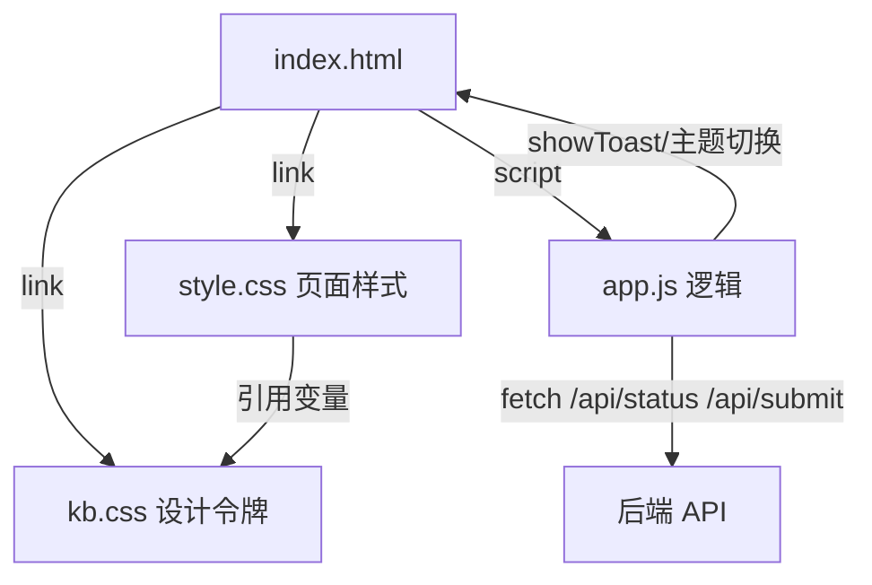

## 用户需求

为 Host\wwwroot 下的 index.html 页面增加 light/dark 双色主题支持，并默认使用 light 主题；主题视觉必须采用 kb.css 中已定义的设计令牌（design tokens）。同时为该页面在右下角新增 toast 消息显示 UI，用于向用户提示消息。

## 产品概述

在现有仪表盘页面（index.html + style.css + app.js）基础上引入 kb.css 的 light/dark 设计令牌体系，将现有页面样式从硬编码深色改为引用令牌变量以实现主题切换，默认 light，并提供顶栏手动切换按钮。新增右下角 toast 容器与 showToast API，并把任务提交结果与轮询异常接入 toast 提示。

## 核心功能

- 引入 kb.css 令牌：index.html 引用 kb.css，html 标签设置 data-theme="light" 作为默认。
- 主题重构：style.css 现有颜色/渐变/边框全部改为引用 kb.css 的 --ui-*、--accent*、--card-*、--shadow*、--radius* 等令牌，dark 主题通过 kb.css 的 html[data-theme="dark"] 自动生效。
- 顶栏切换按钮：在 .topbar-meta 内新增 light/dark 切换按钮，点击在 light/dark 间切换（可选 localStorage 持久化）。
- 右下角 toast：新增 #toastContainer 固定定位容器与 .toast 系列样式（info/success/warn/error），带进入/退出动画。
- showToast API：app.js 暴露 showToast(message, type, duration) 函数，并在任务提交成功/失败、状态轮询异常处调用。

## 技术栈

- 前端：原生 HTML + CSS + JavaScript（无框架、无构建步骤，静态页面直接运行）
- 现有文件作为修改目标：index.html、style.css、app.js；kb.css 仅被引用（只读借用令牌，不修改）

## 实现方案

### 总体策略

采用"令牌借用"方式：保留 index.html 现有结构与 app.js 现有轮询/提交逻辑，仅将视觉层改为基于 kb.css 设计令牌。kb.css 已包含 `:root`（light）与 `html[data-theme="dark"]`（dark）两套完整令牌，index.html 只需引入 kb.css 并在 `<html>` 设置 `data-theme="light"`。style.css 将原硬编码的深色变量替换为对 kb.css 令牌的引用，light/dark 切换即由 data-theme 属性驱动令牌值变化而自动完成。

### 关键技术决策

1. **引入顺序**：index.html 中先引入 kb.css 再引入 style.css，确保 style.css 可覆盖 kb.css 中与 index.html 结构无关但会冲突的少量规则（如 kb.css 的 body 背景/字体），保持 index.html 外观归属 style.css 控制。
2. **令牌映射**：style.css 原 `--bg-0/-bg-1/-bg-2` 映射为 `--ui-background/--ui-background-alt/--ui-border`；`--text-0/-text-1` 映射为 `--ui-foreground/--ui-foreground-muted`；`--primary-0/-primary-1/-primary-2` 映射为 `--accent/--accent-hover/--accent`；状态色 `--success/--danger/--warn` 保留（kb.css 未定义，style.css 自行保留并补 dark 覆盖）。
3. **玻璃质感处理**：kb.css 的 light 令牌偏实色（VS Code 亮色），原玻璃模糊半透明在 light 下观感差。light 主题下改用实色背景（--ui-background / --ui-background-alt）与 --ui-border 描边；dark 主题下保留 kb.css dark 令牌（--ui-background 为 #1e1e1e 等）同样以实色呈现，保证双主题一致可读，避免半透明叠加导致的对比度问题。
4. **主题切换按钮**：复用 kb.css 的 `.btn` / `.btn.primary` 类（已在 kb.css 定义，作用于 index.html 按钮），无需在 style.css 重复定义；切换逻辑写入 app.js，读取 `document.documentElement.dataset.theme`，切换并可选写入 localStorage。

### 性能与可靠性

- 主题切换仅修改 `<html>` 的 data-theme 属性，浏览器通过 CSS 变量级联一次性重绘，无 JS 重排版开销；body 的 transition 已在 kb.css 定义（background-color/color 0.35s），切换平滑。
- toast 使用 `setTimeout` 自动移除 DOM 节点，避免节点堆积；showToast 对重复消息不做去重（保持简单，符合 YAGNI）。
- 轮询异常 toast 补充而非替换 console.warn，避免生产环境丢失日志。

## 实现注意事项

- **不修改 kb.css**：仅引用，所有与 index.html 结构冲突的样式由 style.css 覆盖。
- **向后兼容**：index.html 现有所有 id（clusterName、onlineChip、各 m*/seg*、nodeList、failureList、logStream、statusbar 各项、btnSubmit、submitResult）保持不变，app.js 逻辑不变。
- **默认 light 保证**：`<html data-theme="light">` 硬编码，不引入 prefers-color-scheme 媒体查询强制，确保刷新后始终 light；localStorage 仅作为用户手动切换后的可选记忆。
- **图标轻量**：切换按钮使用纯文本/Unicode（如 ☀ / ☾）或内联 SVG，不引入外部图标库，避免网络依赖。

## 架构设计



修改仅发生在表现层与少量脚本粘合，数据层（/api/*）完全不受影响。

## 目录结构

```
Host/wwwroot/
├── index.html   # [MODIFY] 引入 kb.css；html 设 data-theme=light；顶栏新增主题切换按钮；body 末新增 #toastContainer 容器
├── style.css    # [MODIFY] 颜色/渐变/边框改为引用 kb.css 令牌；新增 .btn 适配（或复用 kb.css）、.toast-container/.toast 系列样式；补充无法由令牌覆盖的 dark 覆盖规则
├── app.js       # [MODIFY] 新增 showToast(message,type,duration)；新增主题切换逻辑与按钮事件；任务提交结果接入 showToast；tick 轮询异常接入 showToast
└── kb.css       # [引用] 仅被 link 引入，提供 light/dark 设计令牌，不修改
```

## 关键代码结构

app.js 需新增的接口（其余保持现有 IIFE 结构）：

```js
// 右下角 toast 提示
function showToast(message, type = 'info', duration = 3000) { /* 创建 .toast 插入 #toastContainer，定时移除 */ }

// 主题切换：读取/写入 document.documentElement.dataset.theme，可选 localStorage
function initThemeToggle() { /* 绑定 #themeToggle 点击，light<->dark 切换并更新按钮文案 */ }
```

## 设计风格

采用与 kb.css 一致的 VS Code 风格设计令牌驱动的双主题界面。默认 light 为 VS Code 亮色（白底、深灰文字、蓝色强调），dark 为 VS Code Dark+（深灰底、浅灰文字、蓝色强调）。整体保持现有仪表盘的信息密度与卡片网格布局，仅将颜色体系切换为令牌驱动，确保 light/dark 一致、清晰、可读。

## 页面区块设计

- **顶栏（topbar）**：保留品牌区与元信息区，右侧 meta-chip 后新增 light/dark 切换按钮（复用 kb.css .btn 样式，含 ☀/☾ 文案），点击切换主题。
- **主体网格（grid）**：六张卡片（提交任务、算力负载、任务进度、节点心跳、失败调试、日志流）保持原布局；颜色从硬编码深色改为令牌：卡片背景用 --ui-background、边框 --ui-border、标题 --ui-foreground-muted、强调数值用 --accent。
- **状态栏（statusbar）**：背景/文字改用令牌，分隔线用 --ui-border。
- **右下角 toast 容器**：固定定位（position: fixed; right/bottom），垂直堆叠多个 .toast；四种类型（info/success/warn/error）分别用 --accent、--card-green、--warn、--danger 强调色与对应 soft 背景；带滑入/淡出过渡。

## 交互与动效

- 主题切换：body 背景/文字 0.35s 过渡（kb.css 已定义）。
- toast：出现时从右侧滑入 + 淡入，消失时淡出后移除；悬停可暂停自动关闭（可选）。
- 卡片 hover 保留轻微上浮（translateY），使用 --shadow-md 与 --accent 描边。